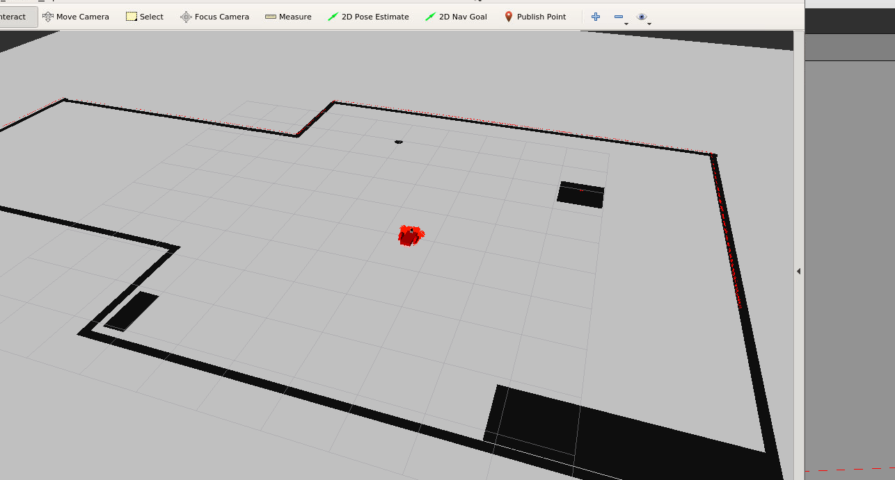

# Where am I Project - Robotics Udacity ND
## AMCL ROS package to localize a differential robot in Gazebo

A differential drive robot using adaptive Monte Carlo localization algorithm to localize itself in a map. In this case the amcl node is subcribed to laser and odometry data.

**Dependencies**

`$ sudo apt-get install ros-kinetic-navigation`

`$ sudo apt-get install ros-kinetic-map-server`

`$ sudo apt-get install ros-kinetic-move-base`

`$ sudo apt-get install ros-kinetic-amcl`

**Try with your own World!**

*Follow this instructions to create a map from your own gazebo world*

PGM map creator deps

`$ sudo apt-get install libignition-math2-dev protobuf-compiler`

Open a terminal to copy your world file into pgm_map_creator subfolder,

`cp ~/your_world_file.world src/pgm_map_creator_world/`

Edit this world file you just copied, adding a single line to insert the map creator plugin just befor closing the `</world>` tag:

`<plugin filename="libcollision_map_creator.so" name="collision_map_creator"/>`

run gzerver with your modified map file:

`gzserver src/pgm_map_creator/world/<YOUR GAZEBO WORLD FILE>`

Open another terminal to launch the `request_publisher` node

`roslaunch pgm_map_creator request_publisher.launch`

It will create a pgm map in the folder `src/pgm_creator_map/maps/`

Copy this file `map.pgm` into `src/my_robot/maps/`

Now, if you rename `.pgm` file, check the `mymap.yaml` file, placed in subfolder `pgm_map_creator/maps`, has the correct value for the `image` param.

# Demo

Launch in a terminal, after build and source the environment variables:
    `roslaunch my_robot world.launch`

Open a new terminal, source the environment variables and type:
    `roslaunch my_robot amcl.launch`

**Set a 2D Navigation Goal in RVIZ**

 

**Using teleop twist keyboard**

Open a new terminal and type:
     `rosrun teleop_twist_keyboard teleop_twist_keyboard.py`
     
  
